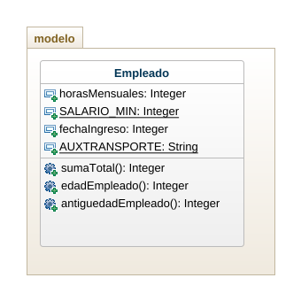

# Caso_Empresa

Una empresa desea conocer el total a pagar por conceptos de salarios a sus empleados. Cada empleado trabaja un numero de horas mensuales y recibe una valoración por esa hora de trabajo. Si el empleado gana menos de dos salarios minimos, entonces recibe un auxilio de transporte. Adicionalmente, se desea calcular la edad del empleado, y la antiguedad del empleado sabiendo su fecha de ingreso a la empresa.

## Diagrama

